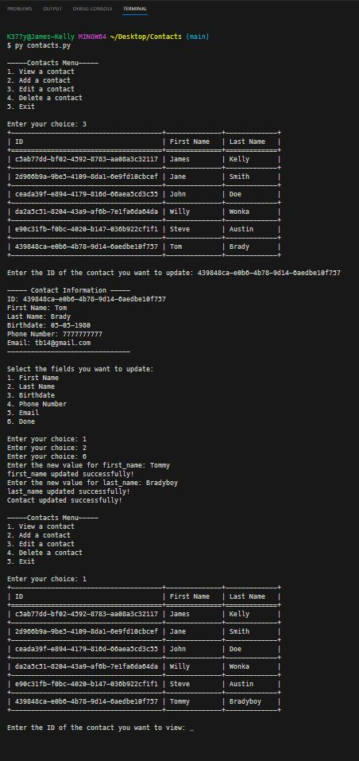

# Digital Rolodex

 

## Description
This is a digital Rolodex type application that allows the user to create, read, update, and delete contacts. The user can select a contact_id and view that contact's information in the terminal window.
 

### ***Some notes about the Python uuid module:*** 
 - UUIDs are useful for generating unique identifiers in various applications, such as database records, distributed systems, and network protocols. 
 - UUIDs are typically represented as strings in the format "xxxxxxxx-xxxx-xxxx-xxxx-xxxxxxxxxxxx", where each "x" represents a hexadecimal digit. 
 - You can convert a UUID to and from its string representation using the str() and uuid.UUID() functions, respectively. 

### ***Some notes about the Python tabulate module:*** 
 - The tabulate module provides a convenient way to create formatted tables from tabular data. 
 - The module supports various table formats, such as plain text, simple grids, Markdown, HTML, and more. 
 - The module accepts data in different formats, including lists of lists, dictionaries, and pandas DataFrames. 

### ***Some notes about the Python json module:*** 
 - The json module allows you to encode (serialize) Python objects into JSON format and decode (deserialize) JSON data into Python objects. 
 - json.dumps() is used to convert a Python object into a JSON string representation. 
 - json.loads() is used to parse a JSON string and convert it back into a Python object. 
 - The module supports pretty printing of JSON data for better readability using the json.dumps() function with the indent parameter. 

## *Installation & Usage*
### There are 2 possible ways you may want to start this application:
#### 1) If you want to test this application with some mock data, you can run the `seed.py` script in your terminal. This will create the file `contacts.json` in the root folder and populate it with some mock data. 

 

#### 2) Then, with the populated database, or with a fresh database, you can run the `contacts.py` script in your terminal. This will start the application and prompt you to choose an action. (Note: the contacts.json file must have 2 empty brackets in it if you choose to use a blank database.) 

 
 

### When prompted: 
 - Choose one of the options by typing the corresponding number and pressing enter. 
    - If you choose to create a new contact, you will be prompted to enter the contact's information. 
    
    - If you choose to read a contact, you will be prompted to enter the contact_id of the contact you wish to view. 
    
    - If you choose to update a contact, you will be prompted to enter the contact_id of the contact you wish to update, and then you will select which data you wish to change. 
    
    - If you choose to delete a contact, you will be prompted to enter the contact_id of the contact you wish to delete, then asked for confirmation to delete. 
    
    - If you choose to exit the application, the application will close. 
 
 

## *Questions*
<h3>Portfolio:&emsp;<a href="https://jk377y.dev" target="_blank">https://jk377y.dev</a></h3>
<h3>Email:&emsp;<a href="mailto:jk377y@gmail.com" target="_blank">jk377y@gmail.com</a></h3>
<h3>LinkedIn:&emsp;<a href="https://www.linkedin.com/in/james-kelly-software-developer/" target="_blank">https://www.linkedin.com/in/james-kelly-software-developer/</a></h3>
<h3>GitHub:&emsp;<a href="https://github.com/jk377y" target="_blank">https://github.com/jk377y</a></h3>
 

## *License*

 Copyright (c) 2023 James Kelly
 Information on this license can be found at: (https://opensource.org/licenses/MIT)